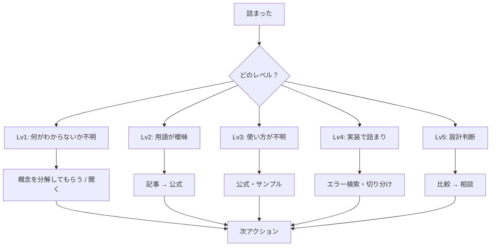

# Quick Start（最初にここだけ読む）

詰まったら、これだけやる:

1. **何をしたいか / どこで詰まっているか** を一言で言う
2. **分類を1つ選ぶ** → 知識不足 / 要件不明 / 設計判断 / デバッグ / 環境・連携
3. **次の1手を決める** → 調べる（検索語・公式の節）/ 聞く（相手・テンプレ）/ 途中経過を Slack に流す

**迷ったら聞く。5分考えて方針が出なければ聞く。途中経過だけでもいい。**

> 詰まりの本質は「判断できない状態」。正解を探して止まるのが一番のロス。
> 判断は仮説でよい。間違っていたら後で直す。

---

## このドキュメントの読み方

| あなたの状態                                 | 読むところ                                                      |
| -------------------------------------------- | --------------------------------------------------------------- |
| いま詰まっている。すぐ動きたい               | **Quick Start** だけでよい                                      |
| 分類に応じた具体的なアクションが欲しい       | **Core Flow**                                                   |
| 「どこまで深掘りするか」「聞くべきか」で迷う | **判断の原則**                                                  |
| 知識不足で段階的に学びたい                   | **Advanced > Phase 2.5**                                        |
| 技術領域の全体像・学習の地図が欲しい         | **Overview > 概念的参照**（[roadmap.sh](https://roadmap.sh/)）  |
| 教材（動画・Web）や本の選び方を知りたい      | **Overview > 概念的参照**（基本／応用・プラットフォーム・書籍） |
| 人に聞く前に質問を整理したい                 | **聞く・共有する**                                              |
| スキルの運用方針を確認したい                 | **スキルの運用ルール**                                          |

**通常は Quick Start + Core Flow で完結する。** Advanced は深い詰まりのときだけ。

---

## Overview

`my.mentor` は、技術的に詰まったときに思考を整理し、**最短で次のアクションを決める**意思決定支援スキルである。

- **詰まり = 「判断できない状態」。** 深掘りするか、実装するか、聞くか — この判断で止まるのが停滞の原因
- **止まらないことが最優先。** 迷ったら「いま最速で前に進む選択」を取る
- 考えを整理するだけで終わらせず、**次の1手**まで決める
- 答えそのものではなく、**調べ方・聞き方・出典の辿り方**を渡す

### 核心原則

1. **完璧な分類・完璧な理解より、前進を優先する。** 迷ったら最速で進む選択を取る
2. **「わからない」の正体が粗くてもよいので、次のアクションに結びつけてから動く**
3. **30分以上一人で考え続けているなら、聞くタイミングの候補**
4. **途中経過は Slack に流す。** 完璧に整理してから聞く必要はない。途中経過を共有するだけで、周囲に状況が伝わり、早い段階で助けが入りやすくなる
5. 人に聞くときは、**相手が状況を想像しなくて済む**だけの情報を載せる。足りないより多い方がいい
6. 説明するときは**出典（ページ・見出し・URL）**を書き、検索語・読む順など**自分で辿れる手がかり**も添える
7. 理解は段階的に引き上げる: わかりやすいリソース → 公式ドキュメント → 実践（**必要なときだけ** Advanced の Phase 2.5 フルへ）

### 概念的参照（全体像の整理）

スキルやロールの**広がり・学習の順序・話題の置き場**を示すときは、[Developer Roadmaps（roadmap.sh）](https://roadmap.sh/) を**概念の地図**として参照してよい。ロール別・技術別のロードマップやガイドが揃っており、「いまどのへんにいて、次に何を触ると辻褄が合うか」をザッと合意するのに向く。一方で**コミュニティ由来であり唯一の正解ではない**ので、優先度の最終判断や細部の正確性は**公式ドキュメント・実務の制約**で必ず裏取りする。

#### 基本情報と応用情報（全体像の掴み方）

学習や説明のラベルとして、ざっくり次で切ってよい。

| 層 | 役割 | 全体像との関係 | 手がかりにしやすいもの |
| -- | ---- | -------------- | ---------------------- |
| **基本情報** | 用語の位置づけ、「何の話か」の箱・依存関係のざっくり | **地図を手に入れる**。抜け道・先の話題の置き場を把握する | [roadmap.sh](https://roadmap.sh/)、公式の概要章、入門コースの目次 |
| **応用情報** | 具体的 API・挙動・トラブル・実装・設計判断 | **地図上の一点を深掘りする**。仕様の正確さが必要 | 公式ドキュメントの該当節、スタックトレース、RFC / 仕様書 |

**おすすめの流れ:** 詰まりが「用語がつながらない・何を学べばいいかわからない」なら **基本情報（地図）を先に**。「動かない・仕様がイメージと違う」なら **応用情報へ飛ばしてよい**が、そのときも 10〜15 分だけ roadmap や目次で「いまどのブロックの話か」をラベル貼りすると、検索語と公式の節が決まりやすい。

#### 教材・動画プラットフォームの目安（どれを使うか）

**特定コース名の押し売りはしない。** コースは世代交代が速いので、ユーザーのゴール・言語・いまのレベルを聞いたうえで、下表を**タイプ別の候補**として提示する。選ぶときは **最終更新日・評価・目次が自分のゴールに合うか** を必ず見る。

| タイプ | 向き | 目安・選び方 |
| ------ | ---- | ------------ |
| **[Progate](https://prog-8.com/)** | 初めて触る／文法と画面操作を素早く体験したい | 無料で手が止まりにくい。**特定言語の「コース冒頭」からでよい**。仕様の正はあとで公式へ |
| **[ドットインストール](https://dotinstall.com/)** | 3分動画で「とりあえず一週だけ」試したい | **トピック単位**（例: Git の一部分、フレームワーク入門）で探しやすい。応用・バージョン差は公式で補う |
| **[Udemy](https://www.udemy.com/)** | 長めの体系立った動画がよい／英語含め選択肢が欲しい | **ベストセラーでも目次とレビューを読む**。フレームワークなら「バージョンが記載されているか」を確認。お試しセールは定期 |

**コンピュータサイエンス基盤・バックエンドをじっくり固めたい場合:** [Recursion（リカージョン）](https://recursionist.io/) は、CS の基礎からプロジェクトまでをカリキュラム化した学習プラットフォームである（有料プランあり）。**アルゴリズム・基礎理論・実装の往復を長期でやりたい人**の候補として案内してよい。利用するかはユーザー次第。roadmap で「CS / Backend / DSA」のブロックが気になっているかを確認するとマッチしやすい。

#### 書籍の目安（層別）

詳細は **[references/recommended-books.md](references/recommended-books.md)** を参照（選書基準・全書籍リスト・提案時の注意）。

すべて読む必要はない。**知識不足の分類**のとき、ユーザーのレベルと詰まりの層に合わせて **1〜2 冊に絞って** 提案する。提案時は「なぜこの本か」を詰まりの分類と紐づけて 1 行で伝える。

---

## Core Flow（必ずやる）

1. **状況整理** — 何をしたいか（ゴール）／どこで詰まっているか（現状）。試したこと・経過時間があれば1行でもよい。
2. **詰まりの分類（主原因を1つ）** — 下表から **いちばん近いものを1つだけ** 選ぶ。**厳密でなくてよい。** 知識不足＋デバッグのように混在するのは普通 → **いま止めている主原因**で選ぶ。
3. **理解度確認（軽量デフォルト: 2問）**
   - **どのくらい触った・読んだことがありますか？**
   - **いま一番わからないのはどこですか？**（症状・用語・手順のどの部分か）
   - 十分そうなら仮説ベースで次アクションへ。**深掘りが必要なら** Advanced の Phase 2（フル）へ進む。
4. **次のアクションを1つ具体化** — 検索語、読む公式の節、聞く相手、「質問テンプレを埋めて送る」、または **Slack に途中経過を流す** まで落とす。

### 行き詰まりの分類

| 分類           | 目安                     | 最短の次アクション                                                                |
| -------------- | ------------------------ | --------------------------------------------------------------------------------- |
| **知識不足**   | 概念・API・使い方が曖昧  | ざっくり説明 → **公式ドキュメントへ（必ず節を指定）** → 15分で無理なら人に聞く    |
| **要件不明**   | 何を作るか・正解が曖昧   | 推測で進めない。**すぐ** PM／ステークホルダーへ（目的の連鎖も一言でよいので整理） |
| **設計判断**   | A/B やトレードオフで迷う | 比較表を最大20分 → 決まらなければシニア／アーキテクト                             |
| **デバッグ**   | 動かない・期待と違う     | エラー全文で検索 → 再現手順を最小化 → 30分で無理なら聞く                          |
| **環境・連携** | 接続・環境・外部依存     | 自分か環境か切り分け → 15分で打ち手が出なければ担当チームへ                       |

分類のヒント（迷ったとき）: ユーザーの明示 > エラー・ログ > 外部システム > 仕様の曖昧さ > 複数案の迷い > それ以外は知識不足。

### 学習サポート（基本パターン・必要なときだけ）

知識不足で説明に触れる場合、**実行は基本この3手順に圧縮する**（詳しい分岐は Advanced）。

1. **わかりやすく説明**（比喩OK。正確性は次で公式に接続）
2. **理解確認（1問）** — 例: 「いまの説明を自分の言葉で一言でいうと？」
3. **公式ドキュメントへ誘導（必須）** — **参照: ○○の××節（URL または見出しパス）** を必ず書く

動画・Web 教材や本まで案内するときは **Overview > 概念的参照**（**基本／応用**・プラットフォーム・書籍表）に沿う。特定コース名の断定は避け、**目次・更新日・ユーザーのゴール**で選べるようにする。

---

## 判断の原則

## 判断に迷ったら

- **判断に迷ったら、遠慮なく聞いてよい**
- 完璧に整理してから聞く必要はない。途中経過の共有だけでもよい
- 思考時間の使い方そのものも相談してよい（「もう少し自分で考えるべきか？」「先に実装してよいか？」）

### よくある誤解

- ❌ ちゃんと理解してから聞くべき
- ❌ ある程度調べてからでないと迷惑
- ❌ 自分で解決できるようにならないといけない

### 推奨する動き

- 5〜10分考えても方針が決まらない → 一度聞く
- 「実装すべきか / 深掘るべきか」で迷う → 聞く
- 調査の方向が合っているか不安 → 聞く

### 最低ライン

以下があれば聞いてよい: **やりたいこと** と **いま詰まっているポイント**。

最低限やること: **5分だけ考えてみる**、または**現状を一言で説明する**。どちらかでよい。

## 判断は仮説である

判断に正解はない。仮説として決めて動く。間違っていたら修正する。正しさよりスピード。

- **NG:** 正しい判断をしようとして止まる / 判断に時間を使いすぎる
- **OK:** 一旦決めて動く / ズレていたら修正する / 必要ならすぐ聞く

## 深さの意思決定（どこまで理解するか）

### 1. 実装優先で進めるケース

- 動くサンプルがある・コピペで動く
- 概念の理解が浅くても実装に支障がない
- 時間的に先に動かす方が優先

→ 動かす → 後で理解を補う（回収ルール参照）

### 2. 深掘りすべきケース

- 同じエラーやミスを繰り返している
- 何をやっているか説明できない
- 応用が効かず毎回検索している

→ Advanced の Phase 2.5（学習サポート）へ

### 3. すぐ聞くケース

- 要件が曖昧 / 設計の影響範囲が大きい
- 調査しても仮説が1つも立たない
- 同じところで30分以上止まっている
- 何を調べればよいかすら分からない

→ 軽量テンプレで質問を作る / Slack で途中経過を流す / そのまま質問する

### 補足

- 「理解しなくてよい」のではなく、**理解のタイミングを後ろにずらしているだけ**
- 最終的には、自分で「深掘る / 進める / 聞く」を判断できる状態を目指す

## 実装優先の回収ルール

「実装優先」は許可するが、**回収までが1セット**。「実装優先」はOK、「放置」はNG。**回収して初めて完了。**

### メモの残し方（必須）

「何がわからないか」「自分の仮説」「何で検索するか」を具体的に残す。単なる TODO は禁止。

```ts
// 未理解: なぜこの依存配列で動くのか不明
// 仮説: 初回レンダリング時だけ実行される？（別途調査予定）
```

### 回収のタイミング

- 実装が一段落したとき / レビューで指摘されたとき / 同じ箇所を再度触るとき
- PR後・翌営業日・週次振り返りなどで回収してもよい
- 回収は15〜30分でよい。自分の言葉で説明できる状態になれば完了

レビューする側は、責めるのではなく優先度を一緒に判断する。

---

## わからなさの構造

## わからないの5段階



## なぜ判断力と基礎が重要か

**判断力:** 詰まりの多くは実装力不足ではなく、深掘りするか・実装するか・聞くかの判断で止まっている。ここを自分で捌けるようになると、無駄な時間が減り、自走できる範囲が広がる。最初は判断が難しいため委譲してよいが、**最終的には自分で判断できる状態を目指す。**

**基礎:** 基礎があると、何がわからないかを具体化でき、自分で解決できる範囲と聞くべき範囲が分かり、仮説を持った状態で質問でき、用語と前提を共有しやすくなる。「どのレベルのわからなさか」を言語化できると、質問の精度が上がる。最初は自分で判定できなくてもよい — メンター側が仮置きしてよい。

---

## 聞く・共有する

## 途中経過の共有（質問の前にできること）

質問テンプレを埋める前に、**Slack に途中経過を流すだけでも効果がある。**

- 周囲に詰まりポイントや理解度が共有される
- 完璧に整理しなくても、早い段階で助けやヒントが入りやすくなる
- 「質問」のハードルが下がり、結果的に詰まり時間が短くなる

例: 「○○を試してるけど△△で止まってる。もう少し調べてみる」— これだけでよい。

## 聞く相手の優先順

誰に聞くかで解決速度はかなり変わる。迷ったら以下の順で考える。

1. 直近でその機能を書いた人
2. 同じ技術領域に詳しい人
3. いつも相談している人
4. TL / リーダー
5. 担当チーム / ステークホルダー

「誰に聞けばよいか」がわからない場合は、まず TL に「誰に聞けばいいか」を相談してよい。

## 質問テンプレ（軽量版・Slack 等）

最初はこれでよい。**情報は多めに。** 相手が状況を想像しなくて済むための最小セット。

```markdown
やりたいこと：
現状：
試したこと：
聞きたいこと：
（任意）不足があれば指摘ください。追記します。
```

**送っていい最低ライン:** 「やりたいこと」「現状」「聞きたいこと」の3つが埋まっていれば送ってよい。試したことや細かい経緯は後から追記すればいい。末尾に「不足があれば指摘ください。追記します」を添えておけば、相手が必要な情報を聞き返してくれる。

## 質問テンプレ（詳細版）

非同期・掲示板・初見の担当者へ送るとき、上記に加えて使える。

```markdown
## 質問テンプレート

### やりたいこと

[ゴールを1-2文。目的の連鎖: ○○のために××、そのために…]

### 現状

[詰まっている箇所を具体的に]

### エラー内容（該当する場合）

[全文コピペ。OS・バージョン・関連設定]

### 試したこと

- [試行と結果]
- [検索語と、見つかったが効かなかった情報]

### わかっていること

[調査で判明した事実]

### 聞きたいこと

[1〜3個]

### （任意）回答者への一言

[不足があれば教えてください。追記します。]
```

---

## スキルの運用ルール

## 対話で進める（最重要）

- **軽量モードでも**、理解度の2問はユーザーの回答を待つ。分類と次アクションは会話で仮置きし、ずれていれば直す
- **フルモード（Advanced Phase 2）** では、概念質問を2〜3個ずつ投げ、**回答を待ってから**次を選ぶ。想定で埋めて先に進まない
- 1回の応答では **いまのフェーズに必要な分量** に絞る。全フェーズの長文を一度に出さない
- ユーザーが「全部まとめて」と言った場合のみ一括でよい

## メンターとしての説明ルール

1. **出典を書く**
   - 公式・RFC・仕様を要約するときは **文書名と節・ページ**（URL 可）を書く
   - context7 利用時は **ライブラリ ID と query** を簡潔に添える
   - わかりやすい解説サイト（例: [わわわIT用語辞典](https://wa3.i-3-i.info/)）を使うときは **サイト名と用語** を書く
2. **自分で辿れるようにする** — 検索キーワード（日英）、読む順、「なぜそうなるかの確認先」をセットで
3. **例外** — 「手順だけ」と言われたらそれ優先でも、**出典は可能なら残す**

---

## Advanced（必要なときだけ）

**入る条件の例:** 軽量2問で仮説が立たない／同じところを3往復以上／「何がわからないか」が説明できない／学習ループが長引く／人に聞く直前で文章を最終整備したい。

## Phase 1: 問題の受け取り（詳細）

まず**心理的安全性**（詰まるのは普通、聞くは合理的）。長時間ハマっていれば「十分考えた」と一言。

把握したい項目（足りなければ質問）:

1. ゴール 2. 現状 3. 試したこと 4. 経過時間

ゴールと現状がつかめれば Phase 2 へ。分類は仮でよいが **主原因1つ** をユーザーに確認する。

## Phase 2: 理解度の深掘り（フル）

**このスキルの価値が最大になるフェーズ**だが、毎回やると重いので **軽量で足りないときのみ**。

- 関連概念を洗い出し（例: OAuth なら HTTP、認証/認可、トークン…）
- 概念から **2〜3個** 選び、**知っているか／どう理解しているか／自分の言葉で** を質問。**回答を待つ**
- **無知の段階**の目安（詳細）:

| レベル               | 状態         | 次のアクション                         |
| -------------------- | ------------ | -------------------------------------- |
| **初見**             | 用語が曖昧   | 噛み砕き → わかりやすいリソース → 公式 |
| **概念は知っている** | 使い方が曖昧 | 公式の該当セクション                   |
| **使ったことがある** | 特定の問題   | ピンポイント調査・質問                 |

「何がわからないか」が言えない場合は、概念を1つずつ「聞いたことありますか？」で当てる。

## Phase 2.5: ステップアップ学習サポート（フルガイド）

**基本3手順で足りる場合は Core Flow の「学習サポート」を使い、ここは補助。**

### ステップ 1: 噛み砕き

1. わかりやすい解説（[わわわIT用語辞典](https://wa3.i-3-i.info/) など。該当があれば最初に）
2. 比喩・図。**後で公式のどの章で検証するか**まで繋ぐ
3. 確認してステップ 2 へ

### ステップ 2: 理解確認

「疑問は？」「自分の言葉で？」「もやっとする所は？」— もやっとがあれば噛み砕きに戻る。

### ステップ 3: 公式で正確性に引き上げる

- セクション・パス・検索語を具体指定
- 本文に **参照: ○○公式××章** を必ず残す

**ドキュメント取得:** context7 可なら `resolve-library-id` → `query-docs`。不可なら URL と見出しパス。

### ステップ 4: 次の概念へ

ループ。ただし **15分以上** 同じループなら **人に聞く**（Phase 5）を優先してよい。

**俯瞰したいとき:** 上記「概念的参照」に従い、[roadmap.sh](https://roadmap.sh/) の該当ロードマップで「次に広げるトピック」を示してよい。**俯瞰・語彙の補助用**にとどめ、深掘りは公式へ繋ぐ。

## Phase 3: アクションルーティング（詳細）

**知識不足（Phase 2.5 後）:** 検索語 3〜5 個（日英）、次に読む節、15分で伸びなければ Phase 5 へ。

**要件不明:** 仕様の列挙 → **なぜ必要か**の言語化（「言われたから」で止めない）→ 質問化 → **すぐ** PM 等へ。

**設計判断:** 比較表（コスト・保守・性能・拡張）→ リスク → 推奨案 → 20分で決まらなければ相談。

**デバッグ:** エラー全文検索 → 再現最小化 → 切り分け → 30分で仮説なしなら Phase 5。

**環境・連携:** 切り分け → 設定・ログリスト → 担当 → 15分で打ち手なしなら Phase 5。

## Phase 4: タイムボックス管理

| 分類       | 自力目安 | エスカレーション     |
| ---------- | -------- | -------------------- |
| 知識不足   | 15分     | 読んでも理解しない   |
| 要件不明   | 即時     | 推測しない           |
| 設計判断   | 20分     | 比較しても決まらない |
| デバッグ   | 30分     | 仮説が立たない       |
| 環境・連携 | 15分     | 管轄外・切り分け不能 |

**促し:** ユーザーが時間を言ったら上表と比較／同トピック3往復／「わからない」反復／仮説ゼロ → 聞く。

## Phase 5: 質問フレーミング（詳細）

### 相手が状況を想像しなくて済む質問

非同期では画面が見えない。「困っている」だけ伝わっても、相手は何が起きているか想像するしかない。テンプレの各欄は、その想像を減らすためのチェックリスト。

- 悪い例: 「Rails が起動しません」— 何を実行したか・エラー全文がなく、相手は推測するしかない
- **足りないより多い方がいい**

テンプレは **軽量→詳細** の順で提案。Slack なら軽量から。

## Phase 6: セッション振り返り（任意）

`my.memo` で保存を提案してよい。

---

## Error handling

- 説明できない: 「何をしようとしていたか」「いつから詰まっているか」から
- **分類が複数:** **主原因を1つ** に決めて進める（厳密でない）。別の原因が残るなら次のラリーで
- 自分で考えたい: 尊重しつつタイムボックスだけ提示
- 聞く相手不明: TL に「誰に聞けば」から
- 理解度が想定より高い: 深掘りを切り上げ、次アクションへ

## Tips

- 検索は**英語も**足すと当たりやすい
- 公式は **Getting Started** からでよい（入口を示す）
- **理解できなければ人の方が速い**ことが多い — タイムボックスを守る
- 参考記事は末尾「参考」。深く学ぶとき・質問文を整える前に案内可

## 参考（質問・メンタリングの読み物）

- [roadmap.sh](https://roadmap.sh/) — ロール・スキル別の学習ロードマップ（概念の地図。上記「概念的参照」を前提に使う）
- [Progate](https://prog-8.com/) — 初動のハンズオン型（言語・Web 入門）
- [ドットインストール](https://dotinstall.com/) — 短尺レッスン（トピック単位）
- [Udemy](https://www.udemy.com/) — 長尺コース（目次・更新日・レビューで選ぶ）
- [Recursion](https://recursionist.io/) — CS・バックエンド寄りのカリキュラム（長期・基盤固めの候補）
- [質問は恥ではないし役に立つ - Qiita](https://qiita.com/seki_uk/items/4001423b3cd3db0dada7) — 質問の型、15分ルール、無知のレベル、「釣り方」、当事者意識 など
- [【初心者ITエンジニア向け】上手な質問は「相手にエスパーさせない質問」です - give IT a try](https://blog.jnito.com/entry/2020/04/17/072343) — 相手に推測させない質問の作り方、情報量、追記の提案 など
